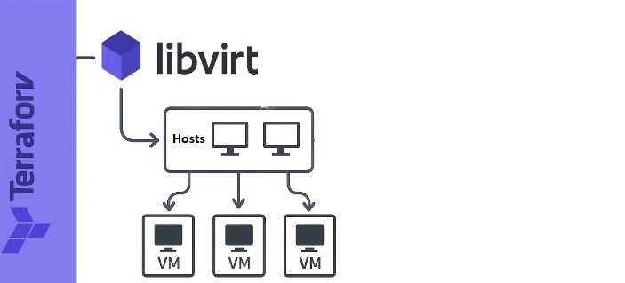

# cluster-terraform
Using the libvirt terraform provider, I will automate the creation of VMs to build in a later stage a Kubernetes cluster.

To get Started I advice you to take a look at this repo (it's from where I created the VM module)
[terraform-libvirt-vm](https://github.com/TahaMohsenZeidy/libvirt-vm-creator-terraform.git)
Also the same prerequisites apply here

