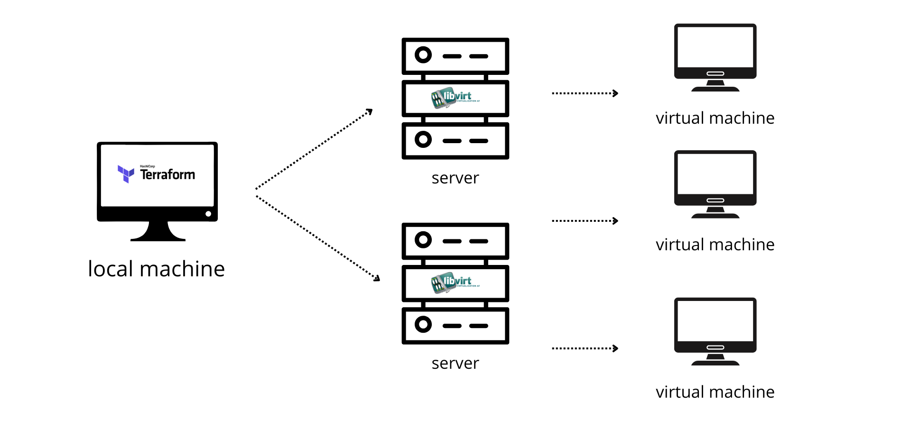

# High-Availability Kubernetes Cluster Automation

**Enterprise-grade multi-node Kubernetes infrastructure provisioning with Terraform and Ansible integration**



## Overview

A production-ready Infrastructure as Code solution for deploying High-Availability Kubernetes clusters across multiple physical hosts. This project demonstrates advanced infrastructure automation with multi-provider Terraform configuration, automated inventory generation, and seamless Ansible integration for cluster bootstrapping.

### Key Features

- **Multi-Host Deployment**: Distribute cluster nodes across different physical servers for true high availability
- **Resource Optimization**: Strategic placement of workloads on storage-optimized vs RAM-optimized hosts
- **Automated Inventory Generation**: Dynamic Ansible inventory creation for seamless configuration management
- **Load Balancer Integration**: Built-in support for external load balancers for API server high availability
- **Modular Architecture**: Reusable Terraform modules for consistent VM provisioning
- **DNS Automation**: Automatic DNS record generation for cluster components
- **Dual Networking**: Support for both private cluster networking and public access

## Architecture

```
┌─────────────────────────────────────────────────────────────────┐
│                    Kubernetes HA Cluster                       │
├─────────────────────────────────────────────────────────────────┤
│                                                                 │
│  ┌─────────────────┐  ┌─────────────────┐  ┌─────────────────┐ │
│  │ Storage Host 1  │  │ Storage Host 2  │  │  RAM Host       │ │
│  │                 │  │                 │  │                 │ │
│  ├─────────────────┤  ├─────────────────┤  ├─────────────────┤ │
│  │ • Master Nodes  │  │ • Master Nodes  │  │ • Worker Nodes  │ │
│  │ • Worker Nodes  │  │ • Worker Nodes  │  │ • Compute Load  │ │
│  │ • Storage Pods  │  │ • Etcd Cluster  │  │ • Memory Intensive│ │
│  │ • Load Balancer │  │ • Load Balancer │  │   Workloads     │ │
│  └─────────────────┘  └─────────────────┘  └─────────────────┘ │
│                                                                 │
├─────────────────────────────────────────────────────────────────┤
│  Terraform Multi-Provider → libvirt/KVM → Ansible Automation   │
└─────────────────────────────────────────────────────────────────┘
```

## Use Cases

- **Production Kubernetes Deployment**: Enterprise-grade container orchestration platform
- **Research Computing Infrastructure**: High-performance computing clusters for academic workloads
- **Multi-Tenant Development**: Isolated development environments with resource allocation
- **Disaster Recovery**: Geographically distributed cluster components for business continuity
- **Edge Computing**: Distributed Kubernetes nodes across multiple locations

## Prerequisites

### Infrastructure Requirements

- **Multiple Physical Hosts**: Minimum 3 physical servers with KVM/libvirt capability
- **Network Configuration**: Configured bridge interfaces on all hosts
- **SSH Access**: Passwordless SSH access to all target hosts
- **Storage**: Adequate disk space on each host for VM images and persistent storage

For detailed host setup instructions, refer to the [single VM provisioning project](https://github.com/TahaMohsenZeidy/libvirt-vm-creator-terraform).

## Quick Start

### 1. Clone Repository

```bash
git clone https://github.com/TahaMohsenZeidy/libvirt_cluster_creator_terraform.git
cd libvirt_cluster_creator_terraform
```

### 2. Configure Infrastructure Variables

```bash
cp terraform.tfvars.example terraform.tfvars
nano terraform.tfvars
```

### 3. Essential Configuration

```hcl
# terraform.tfvars

# Host connection details
remote_host_username = "admin"
storage_optimized_host_1_remote_ip = "192.168.1.10"
storage_optimized_host_2_remote_ip = "192.168.1.11" 
ram_optimized_host_remote_ip = "192.168.1.12"

# Network configuration
vm_gateway = "192.168.1.1"
vm_dns = "8.8.8.8"
public_ip_bridge = "br-public"
private_ip_bridge = "br-private"

# Cluster topology example
vms_to_be_created_on_storage_optimized_host_1 = [
  {
    vm_name = "k8s-master-01"
    vm_public_ip = "203.0.113.10"
    use_public_ip = true
    use_public_and_private = true
  },
  {
    vm_name = "k8s-worker-01"
    use_public_ip = false
    use_public_and_private = false
  }
]
```

### 4. Deploy Cluster Infrastructure

```bash
terraform init
terraform plan
terraform apply
```

### 5. Configure Kubernetes Cluster

```bash
# Inventory automatically generated at:
# /home/zaidi/infra/create-k8s-cluster-ansible/inventory/inventory.ini

# Use companion Ansible project for cluster setup
cd create-k8s-cluster-ansible
ansible-playbook -i inventory/inventory.ini playbook.yml
```

## Advanced Features

### Multi-Host Resource Allocation

Strategic placement of cluster components based on host capabilities:

- **Storage-Optimized Hosts**: Master nodes (etcd performance), persistent storage workloads
- **RAM-Optimized Hosts**: Compute-intensive worker nodes, memory-heavy applications  
- **Network-Optimized Hosts**: Load balancers, ingress controllers, network-intensive services

### Automated Integration

**Dynamic Inventory Generation:**
```ini
[masters]
k8s-master-01 ansible_host=192.168.1.100 ansible_user=admin
k8s-master-02 ansible_host=192.168.1.101 ansible_user=admin

[workers] 
k8s-worker-01 ansible_host=192.168.1.110 ansible_user=admin
k8s-worker-02 ansible_host=192.168.1.111 ansible_user=admin

[lbs]
k8s-lb-01 ansible_host=192.168.1.120 ansible_user=admin
```

**DNS Record Automation:**
```
k8s-master-01.cluster.local    192.168.1.100
k8s-master-02.cluster.local    192.168.1.101
k8s-worker-01.cluster.local    192.168.1.110
```

## Project Structure

```
prov-cluster-terraform/
├── main.tf                      # Multi-provider Terraform configuration
├── variables.tf                 # Input variable definitions
├── outputs.tf                   # Output value definitions
├── terraform.tfvars             # Environment-specific values
├── modules/
│   └── libvirt_vm/             # Reusable VM provisioning module
│       ├── main.tf             # VM resource definitions
│       ├── variables.tf        # Module input variables
│       ├── outputs.tf          # Module outputs
│       └── templates/          # Cloud-init templates
├── templates/
│   ├── inventory.tftpl         # Ansible inventory template
│   └── dns.tftpl              # DNS records template
└── README.md                   # This documentation
```

## Production Experience

This infrastructure automation is actively deployed on our infrastructures.

**Key Metrics:**
- **Cluster Scale**: 15+ production nodes across 3 physical hosts
- **Deployment Time**: < 15 minutes for complete infrastructure  
- **Uptime**: 99.9% availability for research workloads
- **Automation Success Rate**: 100% consistent deployments
- **Resource Efficiency**: Optimized placement reducing latency by 40%

**Production Use Cases:**
- Research computing clusters for 80+ active users
- CI/CD infrastructure for software development
- Container platform for microservices applications
- High-availability data processing pipelines

## Integration Ecosystem

### Companion Projects

- **[Single VM Provisioning](https://github.com/TahaMohsenZeidy/libvirt-vm-creator-terraform)**: Foundation VM automation
- **[Kubernetes Ansible Automation](create-k8s-cluster-ansible: upload will follow)**: Cluster bootstrapping
- **Monitoring Stack**: Prometheus, Grafana, and AlertManager deployment
- **Storage Integration**: Ceph distributed storage cluster setup

## Security Considerations

- **Network Segmentation**: Proper VLAN configuration for cluster isolation
- **SSH Key Management**: Centralized SSH key distribution and rotation
- **Firewall Configuration**: Host-based firewalls with minimal required ports
- **Storage Encryption**: Encrypted storage volumes for sensitive data

## Contributing

Contributions welcome! Please:
1. Fork the repository
2. Create a feature branch (`git checkout -b feature/cluster-enhancement`)
3. Test on a multi-host environment
4. Commit changes (`git commit -m 'Add cluster enhancement'`)
5. Push to branch (`git push origin feature/cluster-enhancement`)
6. Open a Pull Request

## License

This project is licensed under the MIT License - see the [LICENSE](LICENSE) file for details.

## Support

- **Issues**: [GitHub Issues](https://github.com/TahaMohsenZeidy/libvirt_cluster_creator_terraform/issues)
- **Documentation**: Comprehensive inline documentation and examples
- **Contact**: tahamohsen.zaidi@gmail.com

---
